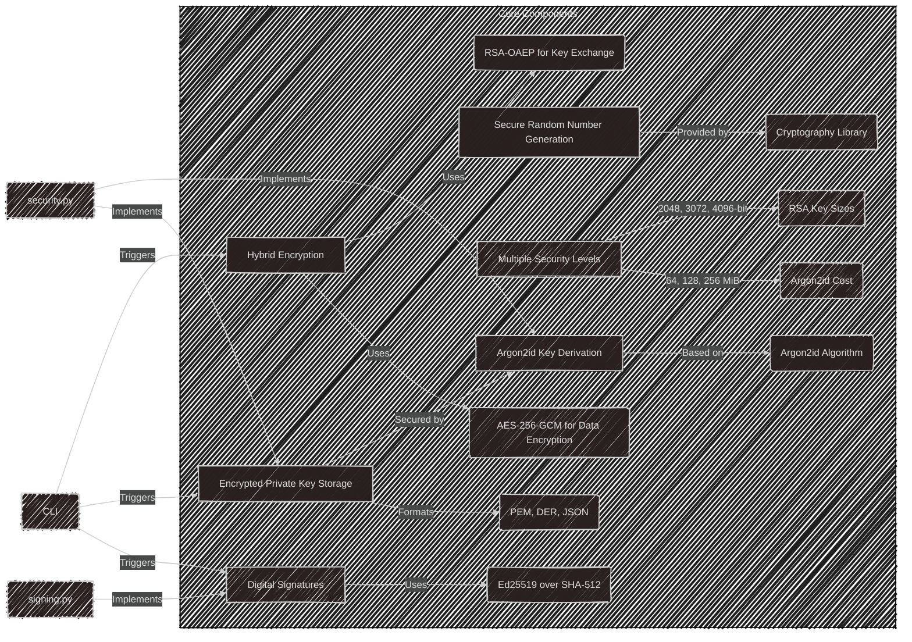

# NyxCrypta

[](#) 
[](#requirements)
[](#license)
[](#contributing)

> A Python cryptography library combining RSA asymmetric encryption and AES symmetric encryption for efficient and secure data protection, with Argon2id-protected private keys and Ed25519 digital signatures.

## 📑 Table of Contents

- [Features](#features)
- [Security Levels](#security-levels)
- [Installation](#installation)
- [Usage](#usage)
  - [Interactive CLI](#interactive-cli)
  - [Key Generation](#key-generation)
  - [Key Format Conversion](#key-format-conversion)
  - [File Encryption/Decryption](#file-encryptiondecryption)
  - [Data Encryption/Decryption](#data-encryptiondecryption)
  - [Digital Signatures](#digital-signatures)
- [Security Features](#security-features)
- [What's New in 3.2.0](#whats-new-in-320)
- [What's New in 3.1.0](#whats-new-in-310)
- [What's New in 3.0.0](#whats-new-in-300)
- [Testing](#testing)
- [Key Format Support](#key-format-support)
- [Python Example](#python-example)
- [Dependencies](#dependencies)
- [Internal Architecture](#internal-links-and-functional-relationships)
- [FAQ](#faq)
- [Security Considerations](#security-considerations)
- [Development Status](#development-status)
- [Contributing](#contributing)
- [Bug Reports](#bug-reports-and-feature-requests)
- [License](#license)
- [Authors](#authors)

## Features

- 🔐 RSA key pair generation with multiple security levels
- 📄 Multiple key formats support (PEM, DER, SSH, JSON)
- 🧱 Private keys protected with Argon2id + AES-256-GCM
- ✍️ Ed25519 digital signatures (sign and verify files)
- 🔒 File encryption and decryption
- 💾 Raw data encryption and decryption
- 🛡️ Strong encryption using RSA + AES hybrid approach
- 🔄 Key format conversion utilities
- 🖥️ Interactive CLI for beginners

## Security Levels

Security Level | RSA Key Size | Argon2id (time / memory / lanes) | Recommended Use
--------------|--------------|----------------------------------|----------------
Standard | 2048-bit | 3 / 64 MiB / 4 | General purpose encryption
High | 3072-bit | 4 / 128 MiB / 4 | Sensitive data protection
Paranoid | 4096-bit | 5 / 256 MiB / 4 | Maximum security requirements

The level sets the RSA key size and the cost of the Argon2id key derivation that protects the private key. The Argon2 parameters are stored inside each key, so a key can be used whatever level is selected later. `signkeygen` (Ed25519) uses the level for the Argon2 cost only.

## Installation

### From PyPI
```bash
pip install nyxcrypta
```

### From Source
```bash
git clone https://github.com/Division-of-Cyber-Anarchy/NyxCrypta.git
cd NyxCrypta
pip install -e .
```

## Usage

### Interactive CLI

Launch the interactive mode:
```bash
nyxcrypta
```

The interactive CLI provides a beginner-friendly interface with:
- Step-by-step wizards for all operations
- Clear explanations of each option
- Secure password input
- Progress indicators
- Tab completion

### Key Generation

```bash
# Generate PEM format key pair
nyxcrypta keygen -o ./keys -p "your_strong_password" -f PEM

# Generate DER format key pair
nyxcrypta keygen -o ./keys -p "your_strong_password" -f DER

# Generate JSON format key pair
nyxcrypta keygen -o ./keys -p "your_strong_password" -f JSON

# Generate SSH format public key
nyxcrypta keygen -o ./keys -p "your_strong_password" -f SSH
# (SSH is public-only: the private key is saved as ./keys/private_key.pem)
```

The private key is always protected with your password through Argon2id (see [Security Features](#security-features)).

### Key Format Conversion

```bash
# Convert PEM to DER
nyxcrypta convert -i ./keys/public_key.pem -o ./keys/key.der --from-format PEM --to-format DER

# Convert DER to SSH (public key only)
nyxcrypta convert -i ./keys/public_key.der -o ./keys/key.ssh --from-format DER --to-format SSH --public

# Re-protect a private key created by 3.1.0 or earlier with Argon2id (same password)
nyxcrypta convert -i ./old_private_key.pem -o ./keys/private_key.pem --from-format PEM --to-format PEM -p "your_password"
```

### File Encryption/Decryption

```bash
# Encrypt a file
nyxcrypta encrypt -i file.txt -o file.nyx -k ./keys/public_key.pem

# Decrypt a file
nyxcrypta decrypt -i file.nyx -o file.txt -k ./keys/private_key.pem -p "your_password"
```

### Data Encryption/Decryption

```bash
# Encrypt raw data
nyxcrypta encryptdata -d "My secret data" -k ./keys/public_key.pem

# Decrypt raw data
nyxcrypta decryptdata -d "encrypted_hex_string" -k ./keys/private_key.pem -p "your_password"
```

### Digital Signatures

Signatures prove that a file comes from the holder of a signing key and was not modified. They use **Ed25519** keys, which are separate from the RSA encryption keys.

```bash
# Generate an Ed25519 signing key pair (signing_private_key.* and signing_public_key.*)
nyxcrypta signkeygen -o ./keys -p "your_strong_password" -f PEM

# Sign a file: writes file.txt.sig (use -o to choose another name)
nyxcrypta sign -i file.txt -k ./keys/signing_private_key.pem -p "your_password"

# Verify: exit code 0 if valid, 1 otherwise
nyxcrypta verify -i file.txt -k ./keys/signing_public_key.pem
nyxcrypta verify -i file.txt -s other.sig -k ./keys/signing_public_key.ssh
```

Encrypting with a public key does **not** authenticate the sender: to prove who produced a file, sign the plaintext, send the `.sig` along with the encrypted file, and have the recipient verify it after decryption.

## Security Features

Feature | Description
--------|------------
Hybrid Encryption | RSA-OAEP for key exchange, AES-256-GCM for data encryption (chunked, authenticated)
Key Derivation | Argon2id turns the password into the 256-bit key that protects each private key (unique 16-byte salt per key, cost set by the security level)
Private Key Protection | Private keys are stored encrypted with AES-256-GCM under the Argon2id-derived key; the KDF parameters are authenticated and bounded when a key is read
Digital Signatures | Ed25519 detached signatures over the SHA-512 digest of the file, with a domain-separation context
Random Generation | Secure random number generation using OS entropy
Multi-level Security | Different RSA key sizes and Argon2id costs

## What's New in 3.2.0

Version 3.2.0 makes the code match what the documentation promised: Argon2 is now really used, files can be signed and verified, and dead code was removed. Encrypted files and data (container v3) and public keys are **unchanged**.

### Changes

| Area | Before (3.1.0) | Now (3.2.0) |
|------|----------------|-------------|
| Argon2 | Documented, imported but never used; private keys relied on the standard PKCS8 password encryption | Argon2id derives the key protecting every private key (`core/security.py`) |
| Signatures | "Verify file integrity" was documented but nothing could sign or verify | `signkeygen`, `sign` and `verify` commands and `save_signing_keys`, `sign_file`, `verify_file`, `sign_data`, `verify_data` in the Python API (Ed25519) |
| `core/security.py` | Only the `SecurityLevel` enum | Argon2id parameters per level and the private key container ("key derivation and storage") |
| Dead code | `NyxCrypta.ph`, `NyxCrypta.get_hash_algorithm()`, `core/utils.py` (`file_exists`), `VersionCompatibility` | Removed |
| Key type checks | An unsuitable key failed with a cryptic error | Clear errors: RSA keys are required to encrypt/decrypt, Ed25519 keys to sign/verify |

### Points to know

- ⚠️ **Private key format change.** Keys generated or converted with 3.2.0 use the NyxCrypta key container (Argon2id + AES-256-GCM): they cannot be read by NyxCrypta older than 3.2.0, nor by OpenSSL. Public keys are unchanged.
- ♻️ **Existing keys keep working.** Private keys from 3.1.0 and earlier (and standard encrypted PKCS8 keys) are still loaded. Upgrade them with `nyxcrypta convert -i old.pem -o new.pem --from-format PEM --to-format PEM -p "password"` (write to a new file rather than overwriting the old key, and keep the old key until you have checked the new one).
- 🧱 **DER private keys.** `private_key.der` is now the binary NyxCrypta container, not an ASN.1 structure. The flag `--to-format DER` is kept for compatibility. Converting without a password still produces an unencrypted standard PKCS8 key.
- 💾 **Memory and time.** Reading or writing a private key costs 64, 128 or 256 MiB of RAM and a fraction of a second, depending on the level the key was created with. This is the point of Argon2: it makes password guessing expensive.
- 🛡️ **Hardened key reading.** The Argon2 parameters found in a key file are bounded (at most 1 GiB and 20 passes), so a crafted key cannot exhaust memory. Changing any parameter makes the key unreadable.
- ✍️ **Signatures.** The file is hashed with SHA-512 (streamed, any file size) and Ed25519 signs a context string plus the digest. The detached `.sig` file is JSON. Signing keys are separate files (`signing_private_key.*`, `signing_public_key.*`): an RSA key cannot sign and an Ed25519 key cannot encrypt. The public key can be exported to OpenSSH format (`ssh-ed25519`).
- 🚦 **Exit codes.** `verify` returns 1 when the signature is invalid, the key does not match, or the file was modified.
- 🧹 **Removed API.** If your code imported `NyxCrypta.get_hash_algorithm`, `NyxCrypta.ph`, `nyxcrypta.core.utils.file_exists` or `VersionCompatibility`, remove those references: the library never used them.
- ⚠️ **Still open.** Passing `-p "password"` on the command line exposes the password in your shell history and process list (see Known limitations below).

## What's New in 3.1.0

Version 3.1.0 fixes functional bugs in the key handling and the CLI. The encryption format is **unchanged** (container v3): files encrypted with 3.0.0 and 3.1.0 are interchangeable.

### Fixes

| Area | Before (3.0.0) | Now (3.1.0) |
|------|----------------|-------------|
| `--key-format` | Accepted but ignored; the format was only detected from the content | Optional: the format is auto-detected, and when you pass it, it is enforced (a wrong value fails instead of being silently ignored) |
| `keygen -f JSON` | Offered by the CLI but refused by `save_keys` | Generates `public_key.json` and `private_key.json` (the private key is always encrypted) |
| Failed encryption | Could leave a partial output file | Output is written to `<output>.part` and moved into place only on success, for encryption as well as decryption |
| `decryptdata` | An empty plaintext was reported as a failure; binary data crashed on `.decode()` | Empty data is a valid result; binary data is shown as hexadecimal with a warning |
| `convert` | The key type was guessed from a `public` substring in the file path (`/home/public/key.pem` was treated as a public key) | The type is read from the key content (PEM header, JSON `type`, DER parsing) |
| Interactive mode | The first error called `sys.exit(1)` and closed the session; Ctrl+C on a prompt raised an exception | Errors and cancelled prompts return to the menu; Ctrl+C on the main menu quits cleanly |

### Points to know

- 🔑 **`--key-format` default changed.** It no longer defaults to `PEM`: omitting it means auto-detection. Scripts that pass it explicitly keep working, and `JSON` is now accepted for `encrypt`, `encryptdata`, `decrypt` and `decryptdata`.
- 🧪 **Exit codes.** In classic CLI mode, a failed operation (wrong password, missing file, failed encryption…) now returns a non-zero exit code, which makes scripting safer. Before, some failures still exited with `0`.
- 🧩 **Python API.** `encrypt_file`, `decrypt_file`, `encrypt_data` and `decrypt_data` gain an optional trailing `key_format` argument (default: auto-detection). Existing calls are unaffected. `handle_command` now returns `True` / `False` and never exits the process.
- 🖥️ **`convert` in interactive mode** no longer asks whether the key is public: the type is detected, and the password is requested only for private keys. `--public` stays available to force public-key handling.

## What's New in 3.0.0

Version 3.0.0 is a **major release**: it fixes several security flaws in the encryption format and is therefore **not backward compatible** with older versions of NyxCrypta.

### Fixes

| Area | Before (≤ 1.5.0) | Now (3.0.0) |
|------|------------------|-------------|
| AES-GCM nonce | One nonce reused for every 1 MB chunk of a file | Unique nonce per chunk (random 8-byte prefix + 4-byte counter) |
| Large files | Files > 1 MB could be encrypted but **not decrypted** | Files of any size round-trip correctly |
| Integrity | Header and chunk order not authenticated | Header, chunk index and "last chunk" flag are authenticated (AAD): tampering, reordering, duplication and truncation are detected |
| JSON private keys | `convert ... --to-format JSON` stored the key **unencrypted** | The key is always stored encrypted and a password is required |
| SSH key generation | `keygen -f SSH` discarded the private key | The private key is saved as `private_key.pem` next to `public_key.ssh` |

### Points to know

- ⚠️ **Format change.** Files and data encrypted with 3.0.0 use container format **v3** and **cannot be decrypted by NyxCrypta 1.x**. Upgrade every machine that needs to read them.
- ♻️ **Existing files (v2) remain readable.** NyxCrypta 3.0.0 still decrypts files and data produced by 1.x and logs a warning. Those files were encrypted with a reused nonce and have no truncation protection, so **decrypt and re-encrypt them** with 3.0.0.
- 🔑 **SSH is a public-key-only format.** `keygen -f SSH` writes `public_key.ssh` (OpenSSH) and an encrypted `private_key.pem`. Use the `.pem` file to decrypt.
- 🔐 **JSON private keys require a password.** Exporting an unencrypted private key to JSON is refused. Existing `.json` private keys created by 1.x may contain an **unencrypted key**: delete them, treat the key as compromised if the file was shared or stored somewhere untrusted, and regenerate your keys.
- 🧩 **Key format auto-detection.** Keys given to `encrypt`, `decrypt`, `encryptdata` and `decryptdata` are detected from their content (PEM, DER, SSH or JSON). Since 3.1.0, `--key-format` can also force a format.
- 🧹 **Safer decryption.** Output is written to `<output>.part` and moved into place only after every chunk is authenticated. A failed decryption never leaves partial plaintext behind.
- 📦 **Python API unchanged.** `NyxCrypta`, `SecurityLevel`, `KeyFormat` and `KeyConverter` keep the same signatures. Failures still return `False` / `None`.

### Known limitations

- Passing `-p "password"` on the command line exposes the password in your shell history and process list. Prefer the interactive mode for sensitive operations.

## Testing

Run the comprehensive test suite:
```bash
nyxcrypta test
```

## Key Format Support

### Public Keys
- PEM format (.pem)
- DER format (.der)
- OpenSSH format (.ssh)
- JSON format (.json)

### Private Keys
- PEM format (.pem): PEM armor around the Argon2id key container
- DER format (.der): the binary Argon2id key container
- JSON format (.json): the PEM form wrapped in JSON, always encrypted

Private keys from NyxCrypta 3.1.0 and earlier (standard encrypted PKCS8 in PEM or DER) can still be loaded.

### Key Types
- RSA keys (`keygen`): encryption and decryption
- Ed25519 keys (`signkeygen`): signing and verification. Public keys can also be exported as OpenSSH (`ssh-ed25519`)

## Python Example

```python
from nyxcrypta import NyxCrypta, SecurityLevel, KeyFormat

# Initialize NyxCrypta
nx = NyxCrypta()  # Uses STANDARD security level by default

# Generate key pair
nx.save_keys("./keys", "your_password", KeyFormat.PEM)

# Encrypt a file
nx.encrypt_file("secret.txt", "secret.nyx", "./keys/public_key.pem")

# Decrypt a file
nx.decrypt_file("secret.nyx", "decrypted.txt", "./keys/private_key.pem", "your_password")

# Encrypt and decrypt data
message = b"Hello, World!"
encrypted = nx.encrypt_data(message, "./keys/public_key.pem")
decrypted = nx.decrypt_data(bytes.fromhex(encrypted), "./keys/private_key.pem", "your_password")
print(decrypted.decode())  # Prints: Hello, World!

# Using higher security level
nx_secure = NyxCrypta(SecurityLevel.PARANOID)
nx_secure.save_keys("./secure_keys", "your_password", KeyFormat.PEM)

# Digital signatures (Ed25519)
nx.save_signing_keys("./keys", "your_password", KeyFormat.PEM)
nx.sign_file("secret.txt", "./keys/signing_private_key.pem", "your_password")  # writes secret.txt.sig
print(nx.verify_file("secret.txt", "secret.txt.sig", "./keys/signing_public_key.pem"))  # True / False

# Signing raw bytes
signature = nx.sign_data(b"Hello, World!", "./keys/signing_private_key.pem", "your_password")
print(nx.verify_data(b"Hello, World!", signature, "./keys/signing_public_key.pem"))  # True

# Key format conversion
from nyxcrypta import KeyConverter

# Convert public key from PEM to SSH format
with open("./keys/public_key.pem", "rb") as f:
    pem_data = f.read()
ssh_key = KeyConverter.convert_public_key(pem_data, KeyFormat.PEM, KeyFormat.SSH)
with open("./keys/public_key.ssh", "wb") as f:
    f.write(ssh_key)

# Convert private key from PEM to DER format
with open("./keys/private_key.pem", "rb") as f:
    pem_data = f.read()
der_key = KeyConverter.convert_private_key(
    pem_data,
    KeyFormat.PEM,
    KeyFormat.DER,
    "your_password".encode()
)
with open("./keys/private_key.der", "wb") as f:
    f.write(der_key)
```

## Dependencies

Package | Version | Purpose
--------|---------|--------
cryptography | >=41.0.5 | Core cryptographic operations
argon2-cffi | >=20.1.0 | Argon2id key derivation protecting private keys
cffi | >=1.17.1 | C interface for cryptographic operations
tqdm | >=4.67 | Progress bars for operations
questionary | >=2.0.1 | Interactive prompts for the CLI
rich | >=13.7.0 | Rich text and beautiful formatting in the terminal

## Internal Architecture

### Core Components


```mermaid
---
config:
  layout: fixed
  theme: neo-dark
  look: handDrawn
---
graph LR
    A[Hybrid Encryption]
    B[Argon2id Key Derivation]
    C[Secure Random Number Generation]
    D[Multiple Security Levels]
    E[Encrypted Private Key Storage]
    S[Digital Signatures]

    subgraph "Core Components"
        A -->|Uses| F(RSA-OAEP for Key Exchange)
        A -->|Uses| G(AES-256-GCM for Data Encryption)
        B -->|Based on| H(Argon2id Algorithm)
        C -->|Provided by| I(Cryptography Library)
        D -->|2048, 3072, 4096-bit| J(RSA Key Sizes)
        D -->|64, 128, 256 MiB| M(Argon2id Cost)
        E -->|Secured by| B
        E -->|Formats| K(PEM, DER, JSON)
        S -->|Uses| N(Ed25519 over SHA-512)
    end

    CLI -->|Triggers| A
    CLI -->|Triggers| E
    CLI -->|Triggers| S
    security.py -->|Implements| B
    security.py -->|Implements| E
    signing.py -->|Implements| S
```

### Module Structure

1. **Core Functions (`core/`)**
   - `crypto.py`: Encryption/decryption, key generation and the signing API
   - `security.py`: Security levels, Argon2id key derivation and the private key container
   - `signing.py`: Ed25519 detached signatures (hashing, signature file, verification)
   - `compatibility.py`: Key loading, serialization and format conversion

2. **CLI Interface (`cli/`)**
   - `commands.py`: Command definitions
   - `parser.py`: Input parsing
   - `interactive.py`: Interactive menus and prompts

3. **Testing (`test_runner.py`)**
   - Automated testing suite
   - Performance metrics

## FAQ

### What is hybrid encryption?
NyxCrypta uses RSA for secure key exchange and AES for efficient data encryption, combining the strengths of both approaches.

### Why use Argon2?
Argon2id is memory-hard: every password guess costs a fixed amount of RAM and time (64 to 256 MiB here), which makes brute-force attacks with GPUs or dedicated hardware far more expensive than with classic key derivation functions.

### How secure is the random number generation?
We use `os.urandom` and the cryptography library's secure random number generators.

### What security level should I choose?
- Standard (2048-bit): General use
- High (3072-bit): Sensitive data
- Paranoid (4096-bit): Maximum security

### How are private keys protected?
The password is stretched with Argon2id (random 16-byte salt per key) into a 256-bit key, which encrypts the PKCS8 private key with AES-256-GCM. The result is stored as a NyxCrypta key container (PEM-armored, binary for DER, or wrapped in JSON). The Argon2 parameters are stored in the container and authenticated.

### Can I use my OpenSSL or ssh-keygen keys?
Public keys: yes (PEM, DER and OpenSSH are all read). Standard password-protected PKCS8 private keys are also accepted; use `nyxcrypta convert` to re-protect them with Argon2id. Private keys produced by NyxCrypta 3.2.0 cannot be read by OpenSSL.

### How do I prove who sent a file?
Generate a signing key pair with `signkeygen`, sign the file with `sign` and give the recipient the `.sig` file and your `signing_public_key.*`. The recipient runs `verify`. Encryption alone does not identify the sender.

## Security Considerations

- Use strong passwords for private keys
- Keep private keys secure
- Choose appropriate security levels
- Update encryption keys regularly
- Verify the signature of files you receive (`nyxcrypta verify`) before trusting them
- Keep signing keys and encryption keys separate, and share only the public keys

## Development Status

Current status: Active Development
- API may change
- Some experimental features
- Ongoing security audits

## Contributing

1. Fork the repository
2. Create feature branch (`git checkout -b feature/amazing-feature`)
3. Commit changes (`git commit -m 'Add feature'`)
4. Push to branch (`git push origin feature/amazing-feature`)
5. Open Pull Request

## Bug Reports and Feature Requests

Use the [GitHub issue tracker](https://github.com/Division-of-Cyber-Anarchy/NyxCrypta/issues)

## License

MIT License - see LICENSE file

## Authors

Division of Cyber Anarchy (DCA)
- [Malic1tus]
- [Calypt0sis]
- [NyxCrypta]
- [ViraL0x]

### Contact
- malic1tus@proton.me
- nyxcrypta@proton.me
- calypt0sis@proton.me
- viral0x@proton.me

### GitHub
https://github.com/Division-of-Cyber-Anarchy/

---

*Simplicity is the ultimate sophistication. - Leonardo da Vinci*

[Malic1tus]: https://github.com/malic1tus
[Calypt0sis]: https://github.com/calypt0sis
[NyxCrypta]: https://github.com/nyxcrypta
[ViraL0x]: https://github.com/viral0x