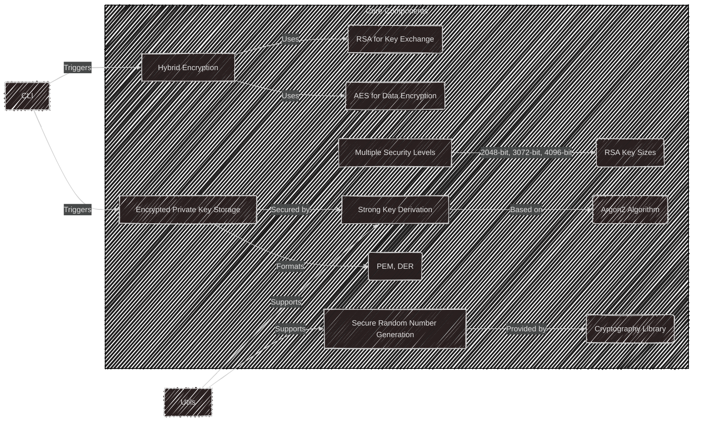

# NyxCrypta

[](#) 
[](#requirements)
[](#license)
[](#contributing)

> A Python cryptography library combining RSA asymmetric encryption and AES symmetric encryption for efficient and secure data protection.

## 📑 Table of Contents

- [Features](#features)
- [Security Levels](#security-levels)
- [Installation](#installation)
- [Usage](#usage)
  - [Interactive CLI](#interactive-cli)
  - [Key Generation](#key-generation)
  - [Key Format Conversion](#key-format-conversion)
  - [File Encryption/Decryption](#file-encryptiondecryption)
  - [Data Encryption/Decryption](#data-encryptiondecryption)
- [Security Features](#security-features)
- [What's New in 3.1.0](#whats-new-in-310)
- [What's New in 3.0.0](#whats-new-in-300)
- [Testing](#testing)
- [Key Format Support](#key-format-support)
- [Python Example](#python-example)
- [Dependencies](#dependencies)
- [Internal Architecture](#internal-links-and-functional-relationships)
- [FAQ](#faq)
- [Security Considerations](#security-considerations)
- [Development Status](#development-status)
- [Contributing](#contributing)
- [Bug Reports](#bug-reports-and-feature-requests)
- [License](#license)
- [Authors](#authors)

## Features

- 🔐 RSA key pair generation with multiple security levels
- 📄 Multiple key formats support (PEM, DER, SSH)
- 🔒 File encryption and decryption
- 💾 Raw data encryption and decryption
- 🛡️ Strong encryption using RSA + AES hybrid approach
- 🔄 Key format conversion utilities
- 🖥️ Interactive CLI for beginners

## Security Levels

Security Level | RSA Key Size | Recommended Use
--------------|--------------|----------------
Standard | 2048-bit | General purpose encryption
High | 3072-bit | Sensitive data protection
Paranoid | 4096-bit | Maximum security requirements

## Installation

### From PyPI
```bash
pip install nyxcrypta
```

### From Source
```bash
git clone https://github.com/Division-of-Cyber-Anarchy/NyxCrypta.git
cd NyxCrypta
pip install -e .
```

## Usage

### Interactive CLI

Launch the interactive mode:
```bash
nyxcrypta
```

The interactive CLI provides a beginner-friendly interface with:
- Step-by-step wizards for all operations
- Clear explanations of each option
- Secure password input
- Progress indicators
- Tab completion

### Key Generation

```bash
# Generate PEM format key pair
nyxcrypta keygen -o ./keys -p "your_strong_password" -f PEM

# Generate DER format key pair
nyxcrypta keygen -o ./keys -p "your_strong_password" -f DER

# Generate SSH format public key
nyxcrypta keygen -o ./keys -p "your_strong_password" -f SSH
# (SSH is public-only: the private key is saved as ./keys/private_key.pem)
```

### Key Format Conversion

```bash
# Convert PEM to DER
nyxcrypta convert -i ./keys/public_key.pem -o ./keys/key.der --from-format PEM --to-format DER

# Convert DER to SSH (public key only)
nyxcrypta convert -i ./keys/public_key.der -o ./keys/key.ssh --from-format DER --to-format SSH --public
```

### File Encryption/Decryption

```bash
# Encrypt a file
nyxcrypta encrypt -i file.txt -o file.nyx -k ./keys/public_key.pem

# Decrypt a file
nyxcrypta decrypt -i file.nyx -o file.txt -k ./keys/private_key.pem -p "your_password"
```

### Data Encryption/Decryption

```bash
# Encrypt raw data
nyxcrypta encryptdata -d "My secret data" -k ./keys/public_key.pem

# Decrypt raw data
nyxcrypta decryptdata -d "encrypted_hex_string" -k ./keys/private_key.pem -p "your_password"
```

## Security Features

Feature | Description
--------|------------
Hybrid Encryption | RSA for key exchange, AES for data encryption
Key Derivation | Argon2 for secure password-based key generation
Random Generation | Secure random number generation using OS entropy
Multi-level Security | Support for different RSA key sizes
Private Key Protection | Encrypted storage of private keys

## What's New in 3.1.0

Version 3.1.0 fixes functional bugs in the key handling and the CLI. The encryption format is **unchanged** (container v3): files encrypted with 3.0.0 and 3.1.0 are interchangeable.

### Fixes

| Area | Before (3.0.0) | Now (3.1.0) |
|------|----------------|-------------|
| `--key-format` | Accepted but ignored; the format was only detected from the content | Optional: the format is auto-detected, and when you pass it, it is enforced (a wrong value fails instead of being silently ignored) |
| `keygen -f JSON` | Offered by the CLI but refused by `save_keys` | Generates `public_key.json` and `private_key.json` (the private key is always encrypted) |
| Failed encryption | Could leave a partial output file | Output is written to `<output>.part` and moved into place only on success, for encryption as well as decryption |
| `decryptdata` | An empty plaintext was reported as a failure; binary data crashed on `.decode()` | Empty data is a valid result; binary data is shown as hexadecimal with a warning |
| `convert` | The key type was guessed from a `public` substring in the file path (`/home/public/key.pem` was treated as a public key) | The type is read from the key content (PEM header, JSON `type`, DER parsing) |
| Interactive mode | The first error called `sys.exit(1)` and closed the session; Ctrl+C on a prompt raised an exception | Errors and cancelled prompts return to the menu; Ctrl+C on the main menu quits cleanly |

### Points to know

- 🔑 **`--key-format` default changed.** It no longer defaults to `PEM`: omitting it means auto-detection. Scripts that pass it explicitly keep working, and `JSON` is now accepted for `encrypt`, `encryptdata`, `decrypt` and `decryptdata`.
- 🧪 **Exit codes.** In classic CLI mode, a failed operation (wrong password, missing file, failed encryption…) now returns a non-zero exit code, which makes scripting safer. Before, some failures still exited with `0`.
- 🧩 **Python API.** `encrypt_file`, `decrypt_file`, `encrypt_data` and `decrypt_data` gain an optional trailing `key_format` argument (default: auto-detection). Existing calls are unaffected. `handle_command` now returns `True` / `False` and never exits the process.
- 🖥️ **`convert` in interactive mode** no longer asks whether the key is public: the type is detected, and the password is requested only for private keys. `--public` stays available to force public-key handling.

## What's New in 3.0.0

Version 3.0.0 is a **major release**: it fixes several security flaws in the encryption format and is therefore **not backward compatible** with older versions of NyxCrypta.

### Fixes

| Area | Before (≤ 1.5.0) | Now (3.0.0) |
|------|------------------|-------------|
| AES-GCM nonce | One nonce reused for every 1 MB chunk of a file | Unique nonce per chunk (random 8-byte prefix + 4-byte counter) |
| Large files | Files > 1 MB could be encrypted but **not decrypted** | Files of any size round-trip correctly |
| Integrity | Header and chunk order not authenticated | Header, chunk index and "last chunk" flag are authenticated (AAD): tampering, reordering, duplication and truncation are detected |
| JSON private keys | `convert ... --to-format JSON` stored the key **unencrypted** | The key is always stored encrypted and a password is required |
| SSH key generation | `keygen -f SSH` discarded the private key | The private key is saved as `private_key.pem` next to `public_key.ssh` |

### Points to know

- ⚠️ **Format change.** Files and data encrypted with 3.0.0 use container format **v3** and **cannot be decrypted by NyxCrypta 1.x**. Upgrade every machine that needs to read them.
- ♻️ **Existing files (v2) remain readable.** NyxCrypta 3.0.0 still decrypts files and data produced by 1.x and logs a warning. Those files were encrypted with a reused nonce and have no truncation protection, so **decrypt and re-encrypt them** with 3.0.0.
- 🔑 **SSH is a public-key-only format.** `keygen -f SSH` writes `public_key.ssh` (OpenSSH) and an encrypted `private_key.pem`. Use the `.pem` file to decrypt.
- 🔐 **JSON private keys require a password.** Exporting an unencrypted private key to JSON is refused. Existing `.json` private keys created by 1.x may contain an **unencrypted key**: delete them, treat the key as compromised if the file was shared or stored somewhere untrusted, and regenerate your keys.
- 🧩 **Key format auto-detection.** Keys given to `encrypt`, `decrypt`, `encryptdata` and `decryptdata` are detected from their content (PEM, DER, SSH or JSON). Since 3.1.0, `--key-format` can also force a format.
- 🧹 **Safer decryption.** Output is written to `<output>.part` and moved into place only after every chunk is authenticated. A failed decryption never leaves partial plaintext behind.
- 📦 **Python API unchanged.** `NyxCrypta`, `SecurityLevel`, `KeyFormat` and `KeyConverter` keep the same signatures. Failures still return `False` / `None`.

### Known limitations

- Passing `-p "password"` on the command line exposes the password in your shell history and process list. Prefer the interactive mode for sensitive operations.

## Testing

Run the comprehensive test suite:
```bash
nyxcrypta test
```

## Key Format Support

### Public Keys
- PEM format (.pem)
- DER format (.der)
- OpenSSH format (.ssh)
- JSON format (.json)

### Private Keys
- PEM format (.pem)
- DER format (.der)
- JSON format (.json)

## Python Example

```python
from nyxcrypta import NyxCrypta, SecurityLevel, KeyFormat

# Initialize NyxCrypta
nx = NyxCrypta()  # Uses STANDARD security level by default

# Generate key pair
nx.save_keys("./keys", "your_password", KeyFormat.PEM)

# Encrypt a file
nx.encrypt_file("secret.txt", "secret.nyx", "./keys/public_key.pem")

# Decrypt a file
nx.decrypt_file("secret.nyx", "decrypted.txt", "./keys/private_key.pem", "your_password")

# Encrypt and decrypt data
message = b"Hello, World!"
encrypted = nx.encrypt_data(message, "./keys/public_key.pem")
decrypted = nx.decrypt_data(bytes.fromhex(encrypted), "./keys/private_key.pem", "your_password")
print(decrypted.decode())  # Prints: Hello, World!

# Using higher security level
nx_secure = NyxCrypta(SecurityLevel.PARANOID)
nx_secure.save_keys("./secure_keys", "your_password", KeyFormat.PEM)

# Key format conversion
from nyxcrypta import KeyConverter

# Convert public key from PEM to SSH format
with open("./keys/public_key.pem", "rb") as f:
    pem_data = f.read()
ssh_key = KeyConverter.convert_public_key(pem_data, KeyFormat.PEM, KeyFormat.SSH)
with open("./keys/public_key.ssh", "wb") as f:
    f.write(ssh_key)

# Convert private key from PEM to DER format
with open("./keys/private_key.pem", "rb") as f:
    pem_data = f.read()
der_key = KeyConverter.convert_private_key(
    pem_data,
    KeyFormat.PEM,
    KeyFormat.DER,
    "your_password".encode()
)
with open("./keys/private_key.der", "wb") as f:
    f.write(der_key)
```

## Dependencies

Package | Version | Purpose
--------|---------|--------
cryptography | >=41.0.5 | Core cryptographic operations
argon2-cffi | >=20.1.0 | Password hashing and key derivation
cffi | >=1.17.1 | C interface for cryptographic operations
tqdm | >=4.67 | Progress bars for operations
rich | >=13.7.0 | Rich text and beautiful formatting in the terminal

## Internal Architecture

### Core Components


```mermaid
---
config:
  layout: fixed
  theme: neo-dark
  look: handDrawn
---
graph LR
    A[Hybrid Encryption]
    B[Strong Key Derivation]
    C[Secure Random Number Generation]
    D[Multiple Security Levels]
    E[Encrypted Private Key Storage]

    subgraph "Core Components"
        A -->|Uses| F(RSA for Key Exchange)
        A -->|Uses| G(AES for Data Encryption)
        B -->|Based on| H(Argon2 Algorithm)
        C -->|Provided by| I(Cryptography Library)
        D -->|2048-bit, 3072-bit, 4096-bit| J(RSA Key Sizes)
        E -->|Secured by| B
        E -->|Formats| K(PEM, DER)
    end

    CLI -->|Triggers| A
    CLI -->|Triggers| E
    Utils -->|Supports| B
    Utils -->|Supports| C
```

### Module Structure

1. **Core Functions (`core/`)**
   - `crypto.py`: Encryption/decryption logic
   - `security.py`: Key derivation and storage
   - `utils.py`: Utility functions
   - `compatibility.py`: Format compatibility

2. **CLI Interface (`cli/`)**
   - `commands.py`: Command definitions
   - `parser.py`: Input parsing

3. **Testing (`test_runner.py`)**
   - Automated testing suite
   - Performance metrics

## FAQ

### What is hybrid encryption?
NyxCrypta uses RSA for secure key exchange and AES for efficient data encryption, combining the strengths of both approaches.

### Why use Argon2?
Argon2 provides strong protection against brute-force attacks and is computationally expensive by design.

### How secure is the random number generation?
We use `os.urandom` and the cryptography library's secure random number generators.

### What security level should I choose?
- Standard (2048-bit): General use
- High (3072-bit): Sensitive data
- Paranoid (4096-bit): Maximum security

### How are private keys protected?
Private keys are encrypted using Argon2-derived keys and stored in encrypted PEM or DER format.

## Security Considerations

- Use strong passwords for private keys
- Keep private keys secure
- Choose appropriate security levels
- Update encryption keys regularly
- Verify file integrity

## Development Status

Current status: Active Development
- API may change
- Some experimental features
- Ongoing security audits

## Contributing

1. Fork the repository
2. Create feature branch (`git checkout -b feature/amazing-feature`)
3. Commit changes (`git commit -m 'Add feature'`)
4. Push to branch (`git push origin feature/amazing-feature`)
5. Open Pull Request

## Bug Reports and Feature Requests

Use the [GitHub issue tracker](https://github.com/Division-of-Cyber-Anarchy/NyxCrypta/issues)

## License

MIT License - see LICENSE file

## Authors

Division of Cyber Anarchy (DCA)
- [Malic1tus]
- [Calypt0sis]
- [NyxCrypta]
- [ViraL0x]

### Contact
- malic1tus@proton.me
- nyxcrypta@proton.me
- calypt0sis@proton.me
- viral0x@proton.me

### GitHub
https://github.com/Division-of-Cyber-Anarchy/

---

*Simplicity is the ultimate sophistication. - Leonardo da Vinci*

[Malic1tus]: https://github.com/malic1tus
[Calypt0sis]: https://github.com/calypt0sis
[NyxCrypta]: https://github.com/nyxcrypta
[ViraL0x]: https://github.com/viral0x