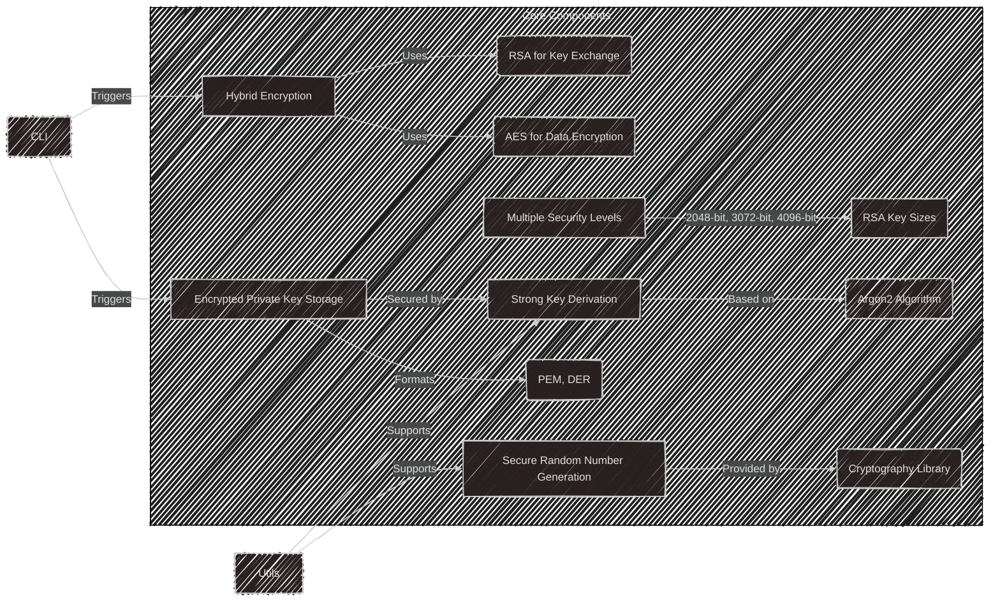

# NyxCrypta

[](#) 
[](#requirements)
[](#license)
[](#contributing)

> A Python cryptography library combining RSA asymmetric encryption and AES symmetric encryption for efficient and secure data protection.

## 📑 Table of Contents

- [Features](#features)
- [Security Levels](#security-levels)
- [Installation](#installation)
- [Usage](#usage)
  - [Interactive CLI](#interactive-cli)
  - [Key Generation](#key-generation)
  - [Key Format Conversion](#key-format-conversion)
  - [File Encryption/Decryption](#file-encryptiondecryption)
  - [Data Encryption/Decryption](#data-encryptiondecryption)
- [Security Features](#security-features)
- [Testing](#testing)
- [Key Format Support](#key-format-support)
- [Python Example](#python-example)
- [Dependencies](#dependencies)
- [Internal Architecture](#internal-links-and-functional-relationships)
- [FAQ](#faq)
- [Security Considerations](#security-considerations)
- [Development Status](#development-status)
- [Contributing](#contributing)
- [Bug Reports](#bug-reports-and-feature-requests)
- [License](#license)
- [Authors](#authors)

## Features

- 🔐 RSA key pair generation with multiple security levels
- 📄 Multiple key formats support (PEM, DER, SSH)
- 🔒 File encryption and decryption
- 💾 Raw data encryption and decryption
- 🛡️ Strong encryption using RSA + AES hybrid approach
- 🔄 Key format conversion utilities
- 🖥️ Interactive CLI for beginners

## Security Levels

Security Level | RSA Key Size | Recommended Use
--------------|--------------|----------------
Standard | 2048-bit | General purpose encryption
High | 3072-bit | Sensitive data protection
Paranoid | 4096-bit | Maximum security requirements

## Installation

### From PyPI
```bash
pip install nyxcrypta
```

### From Source
```bash
git clone https://github.com/Division-of-Cyber-Anarchy/NyxCrypta.git
cd NyxCrypta
pip install -e .
```

## Usage

### Interactive CLI

Launch the interactive mode:
```bash
nyxcrypta
```

The interactive CLI provides a beginner-friendly interface with:
- Step-by-step wizards for all operations
- Clear explanations of each option
- Secure password input
- Progress indicators
- Tab completion

### Key Generation

```bash
# Generate PEM format key pair
nyxcrypta keygen -o ./keys -p "your_strong_password" -f PEM

# Generate DER format key pair
nyxcrypta keygen -o ./keys -p "your_strong_password" -f DER

# Generate SSH format public key
nyxcrypta keygen -o ./keys -p "your_strong_password" -f SSH
```

### Key Format Conversion

```bash
# Convert PEM to DER
nyxcrypta convert -i ./keys/public_key.pem -o ./keys/key.der --from-format PEM --to-format DER

# Convert DER to SSH (public key only)
nyxcrypta convert -i ./keys/public_key.der -o ./keys/key.ssh --from-format DER --to-format SSH --public
```

### File Encryption/Decryption

```bash
# Encrypt a file
nyxcrypta encrypt -i file.txt -o file.nyx -k ./keys/public_key.pem

# Decrypt a file
nyxcrypta decrypt -i file.nyx -o file.txt -k ./keys/private_key.pem -p "your_password"
```

### Data Encryption/Decryption

```bash
# Encrypt raw data
nyxcrypta encryptdata -d "My secret data" -k ./keys/public_key.pem

# Decrypt raw data
nyxcrypta decryptdata -d "encrypted_hex_string" -k ./keys/private_key.pem -p "your_password"
```

## Security Features

Feature | Description
--------|------------
Hybrid Encryption | RSA for key exchange, AES for data encryption
Key Derivation | Argon2 for secure password-based key generation
Random Generation | Secure random number generation using OS entropy
Multi-level Security | Support for different RSA key sizes
Private Key Protection | Encrypted storage of private keys

## Testing

Run the comprehensive test suite:
```bash
nyxcrypta test
```

## Key Format Support

### Public Keys
- PEM format (.pem)
- DER format (.der)
- OpenSSH format (.ssh)
- JSON format (.json)

### Private Keys
- PEM format (.pem)
- DER format (.der)
- JSON format (.json)

## Python Example

```python
from nyxcrypta import NyxCrypta, SecurityLevel, KeyFormat

# Initialize NyxCrypta
nx = NyxCrypta()  # Uses STANDARD security level by default

# Generate key pair
nx.save_keys("./keys", "your_password", KeyFormat.PEM)

# Encrypt a file
nx.encrypt_file("secret.txt", "secret.nyx", "./keys/public_key.pem")

# Decrypt a file
nx.decrypt_file("secret.nyx", "decrypted.txt", "./keys/private_key.pem", "your_password")

# Encrypt and decrypt data
message = b"Hello, World!"
encrypted = nx.encrypt_data(message, "./keys/public_key.pem")
decrypted = nx.decrypt_data(bytes.fromhex(encrypted), "./keys/private_key.pem", "your_password")
print(decrypted.decode())  # Prints: Hello, World!

# Using higher security level
nx_secure = NyxCrypta(SecurityLevel.PARANOID)
nx_secure.save_keys("./secure_keys", "your_password", KeyFormat.PEM)

# Key format conversion
from nyxcrypta import KeyConverter

# Convert public key from PEM to SSH format
with open("./keys/public_key.pem", "rb") as f:
    pem_data = f.read()
ssh_key = KeyConverter.convert_public_key(pem_data, KeyFormat.PEM, KeyFormat.SSH)
with open("./keys/public_key.ssh", "wb") as f:
    f.write(ssh_key)

# Convert private key from PEM to DER format
with open("./keys/private_key.pem", "rb") as f:
    pem_data = f.read()
der_key = KeyConverter.convert_private_key(
    pem_data,
    KeyFormat.PEM,
    KeyFormat.DER,
    "your_password".encode()
)
with open("./keys/private_key.der", "wb") as f:
    f.write(der_key)
```

## Dependencies

Package | Version | Purpose
--------|---------|--------
cryptography | >=41.0.5 | Core cryptographic operations
argon2-cffi | >=20.1.0 | Password hashing and key derivation
cffi | >=1.17.1 | C interface for cryptographic operations
tqdm | >=4.67 | Progress bars for operations

## Internal Architecture

### Core Components



### Module Structure

1. **Core Functions (`core/`)**
   - `crypto.py`: Encryption/decryption logic
   - `security.py`: Key derivation and storage
   - `utils.py`: Utility functions
   - `compatibility.py`: Format compatibility

2. **CLI Interface (`cli/`)**
   - `commands.py`: Command definitions
   - `parser.py`: Input parsing

3. **Testing (`test_runner.py`)**
   - Automated testing suite
   - Performance metrics

## FAQ

### What is hybrid encryption?
NyxCrypta uses RSA for secure key exchange and AES for efficient data encryption, combining the strengths of both approaches.

### Why use Argon2?
Argon2 provides strong protection against brute-force attacks and is computationally expensive by design.

### How secure is the random number generation?
We use `os.urandom` and the cryptography library's secure random number generators.

### What security level should I choose?
- Standard (2048-bit): General use
- High (3072-bit): Sensitive data
- Paranoid (4096-bit): Maximum security

### How are private keys protected?
Private keys are encrypted using Argon2-derived keys and stored in encrypted PEM or DER format.

## Security Considerations

- Use strong passwords for private keys
- Keep private keys secure
- Choose appropriate security levels
- Update encryption keys regularly
- Verify file integrity

## Development Status

Current status: Active Development
- API may change
- Some experimental features
- Ongoing security audits

## Contributing

1. Fork the repository
2. Create feature branch (`git checkout -b feature/amazing-feature`)
3. Commit changes (`git commit -m 'Add feature'`)
4. Push to branch (`git push origin feature/amazing-feature`)
5. Open Pull Request

## Bug Reports and Feature Requests

Use the [GitHub issue tracker](https://github.com/Division-of-Cyber-Anarchy/NyxCrypta/issues)

## License

MIT License - see LICENSE file

## Authors

Division of Cyber Anarchy (DCA)
- [Malic1tus]
- [Calypt0sis]
- [NyxCrypta]
- [ViraL0x]

### Contact
- malic1tus@proton.me
- nyxcrypta@proton.me
- calypt0sis@proton.me
- viral0x@proton.me

### GitHub
https://github.com/Division-of-Cyber-Anarchy/

---

*Simplicity is the ultimate sophistication. - Leonardo da Vinci*

[Malic1tus]: https://github.com/malic1tus
[Calypt0sis]: https://github.com/calypt0sis
[NyxCrypta]: https://github.com/nyxcrypta
[ViraL0x]: https://github.com/viral0x